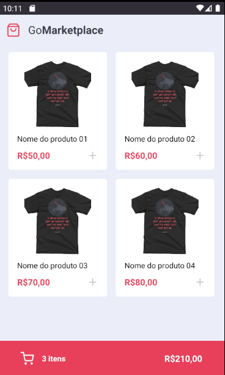
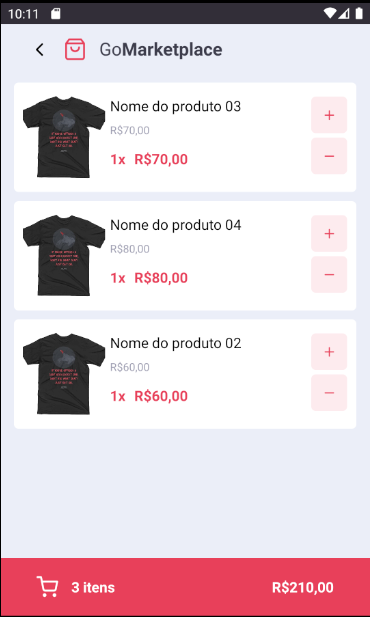

<p align="center">
  
  
</p>
<h1 align=center>GoMarketPlace - Mobile</h1>
<p align="center">This app it's a example of a marketplace app developed in React Native.</p>

## :computer: Tech:
- React Native
- Context API
- React Navigation
- Unform
- Hooks
- Axios
- ESLint + Prettier

## Dependencies
Before start the app run the fake backend:
  - yarn
  - yarn json-server server.json -p 3333

## :running: Run the project:
```shell
  # Clone this repository
  - git clone https://github.com/acpn/app-marketplace

  # Enter project directory
  - cd [project folder]

  # Run the APP:
  Before start the app make sure you have an emulator running.

  Android
    - yarn android

  iOS
    - cd ios
    - pod install
    - yarn ios

```

## :fork_and_knife: Contributing
- Fork this repository;
- Create a branch for your features;
- Push your branch.
